# 🧠 LLM Inference Demo: From Logits to Next Token

A comprehensive, step-by-step educational project that demonstrates **how language models generate the next token** using the complete pipeline found in real LLM APIs (OpenAI, Anthropic, HuggingFace).

---

## 📖 Overview

When you ask a language model to complete "The cat is...", the model doesn't directly output "eating" or "sleeping". Instead, it goes through a multi-step **decoding process** with multiple configurable parameters:

1. **Model outputs raw logits** (unnormalized scores)
2. **Temperature scaling** adjusts the distribution (controls randomness)
3. **Softmax** converts logits to probabilities
4. **Top-k filtering** keeps only the K most likely tokens (optional)
5. **Top-p filtering** keeps tokens until cumulative probability reaches p (optional)
6. **Renormalization** ensures probabilities sum to 1.0
7. **Sampling** selects the final token

This project breaks down each step with **real math**, **explicit code**, and **examples** - just like production LLM systems!

---

## 🎯 Example Scenario

**Input context:**
```
"The cat is"
```

**Candidate tokens the model considers:**
- sleeping
- eating
- playing
- sitting
- jumping

**Goal:** Select the next token using inference parameters.

---

## 🔄 The Complete Process (Production-Ready Pipeline)

```mermaid
flowchart TD
    A["📝 Input Context<br/>'The cat is'"] --> B["🧠 Neural Network<br/>(Transformer Model)"]
    B --> C["📊 Raw Logits<br/>sleeping: 2.8<br/>eating: 2.3<br/>playing: 1.9<br/>sitting: 1.5<br/>jumping: 1.2"]
    
    C --> D["🌡️ STEP 1: Temperature<br/>adjusted_logit = logit / T<br/>(controls randomness)"]
    D --> E["📈 Temperature-Adjusted Logits"]
    
    E --> F["🔢 STEP 2: Softmax<br/>exp + normalize<br/>Convert to probabilities"]
    F --> G["🎲 Initial Probabilities<br/>sleeping: 40.2%<br/>eating: 24.4%<br/>playing: 16.3%<br/>sitting: 11.0%<br/>jumping: 8.1%"]
    
    G --> H["✂️ STEP 3a: Top-K Filter<br/>Keep top K tokens<br/>(optional)"]
    H --> I["🎯 STEP 3b: Top-P Filter<br/>Keep until cumulative ≥ p<br/>(optional)"]
    I --> J["📊 STEP 3c: Renormalize<br/>Ensure sum = 1.0"]
    
    J --> K["🎰 STEP 4: Sampling<br/>Select token from<br/>filtered distribution"]
    K --> L["✅ Selected Token<br/>'eating'"]
    
    L --> M["📝 Output<br/>'The cat is eating'"]
    
    style A fill:#e1f5ff
    style B fill:#fff4e1
    style C fill:#ffe1e1
    style D fill:#fff9e1
    style F fill:#e1ffe8
    style H fill:#ffebcd
    style I fill:#e6e6fa
    style J fill:#f0fff0
    style K fill:#ffe1f5
    style L fill:#c8ffc8
    style M fill:#c8e6ff
```



**Key Feature:** Both Top-K and Top-P can be used together (just like OpenAI, Anthropic, HuggingFace APIs)!

---

## 📐 Detailed Step Breakdown

### **STEP 0: Model Output (Raw Logits)**

The neural network produces **unnormalized scores** for each possible next token:

| Token    | Logit | Meaning |
|----------|-------|---------|
| sleeping | 2.8   | Highest score → Most preferred |
| eating   | 2.3   | Second choice |
| playing  | 1.9   | Third choice |
| sitting  | 1.5   | Fourth choice |
| jumping  | 1.2   | Lowest score → Least preferred |

> ⚠️ **These are NOT probabilities!** They're just raw scores from the model's final layer.
> 
> **What happens next:** These logits go through a decoding pipeline with configurable parameters.

---

### **STEP 1: Apply Temperature** 🌡️

**Formula:**
```
adjusted_logit_i = logit_i / temperature
```

**Purpose:** Control the "sharpness" of the probability distribution.

**Effect of temperature:**
- **T < 1.0** → **Sharper** distribution (more confident, peaked)
  - Example: T=0.5 makes strong preferences even stronger
- **T = 1.0** → **No change** (neutral)
- **T > 1.0** → **Flatter** distribution (less confident, more uniform)
  - Example: T=2.0 makes all options more equal

**Example with T=1.0:**
```python
apply_temperature({'sleeping': 2.8, 'eating': 2.3}, temperature=1.0)
# Result: {'sleeping': 2.8, 'eating': 2.3}  # Unchanged
```

---

### **STEP 2: Exponentiation** 📈

**Formula:**
```
weight_i = e^(adjusted_logit_i)
```

**Purpose:** Convert all values to positive numbers and amplify differences.

**Result:**

| Token    | Adjusted Logit | exp(logit) |
|----------|----------------|------------|
| sleeping | 2.8            | 16.44      |
| eating   | 2.3            | 9.97       |
| playing  | 1.9            | 6.69       |
| sitting  | 1.5            | 4.48       |
| jumping  | 1.2            | 3.32       |

---

### **STEP 3: Softmax (Normalization)** 📉

**Formula:**
```
probability_i = exp(logit_i) / Σ exp(logit_j)
```

**Purpose:** Convert weights to probabilities that sum to 1.0.

**Calculation:**
```
Z = 16.44 + 9.97 + 6.69 + 4.48 + 3.32 = 40.91
```

**Result:**

| Token    | Probability |
|----------|-------------|
| sleeping | 0.402       |
| eating   | 0.244       |
| playing  | 0.163       |
| sitting  | 0.110       |
| jumping  | 0.081       |

✅ Sum = 1.0

---

### **STEP 3: Filtering & Renormalization** ✂️

This step is **optional** and **highly configurable** - you can use Top-K only, Top-P only, both together, or neither!

#### **Step 3a: Top-K Filtering** (Optional - use `-k` flag)

**Purpose:** Keep only the K most probable tokens.

**Example with k=3:**
```
5 tokens → Filter to top 3 → sleeping, eating, playing
```

#### **Step 3b: Top-P Filtering / Nucleus Sampling** (Optional - use `-p` flag)

**Purpose:** Keep tokens until cumulative probability ≥ p.

**Example with p=0.9:**
```
sleeping: 40.2% (cumulative: 40.2%) ✅
eating:   24.4% (cumulative: 64.6%) ✅  
playing:  16.3% (cumulative: 80.9%) ✅
sitting:  11.0% (cumulative: 91.9%) ✅ STOP! >= 90%
jumping:   8.1% ❌ Filtered out
```

**Key insight:** Adapts dynamically - more tokens kept when distribution is flat!

#### **Step 3c: Renormalization** (Always Applied After Filtering)

Rescale filtered probabilities to sum to 1.0:

**Example (after k=3 filtering):**

| Token    | Before Renorm | After Renorm | Change  |
|----------|---------------|--------------|---------|
| sleeping | 0.402         | 0.497        | +23.6%  |
| eating   | 0.244         | 0.301        | +23.6%  |
| playing  | 0.163         | 0.202        | +23.6%  |
| **Sum**  | **0.809**     | **1.000**    | ✅      |

---

### **STEP 4: Sampling** 🎰

**Purpose:** Select the final token based on filtered probability distribution.

**Process:**
1. Build cumulative probability ranges for each remaining token
2. Generate random number: `r ~ Uniform(0, 1)`
3. Find which token's range contains r

**Example with seed=42 (r=0.639):**

| Token    | Probability | Cumulative Range    |
|----------|-------------|---------------------|
| sleeping | 0.497       | [0.000 – 0.497)  ❌ |
| eating   | 0.301       | [0.497 – 0.798)  ✅ |
| playing  | 0.202       | [0.798 – 1.000)  ❌ |

Since **r = 0.639** falls in the **eating** range:

✅ **Selected token:** `eating`

**Final output:** `"The cat is eating"`

---

## 🎓 Key Concepts

### **What the Model Does vs. What Decoding Does**

| Component        | Part Of      | Purpose                                    |
|------------------|--------------|-------------------------------------------|
| Neural Network   | **Model**    | Learns patterns, produces logits          |
| Logits           | **Model**    | Raw scores expressing preferences         |
| Temperature      | **Decoding** | Reshapes distribution                     |
| Softmax          | **Decoding** | Converts to probabilities                 |
| Top-k / Top-p    | **Decoding** | Filters unlikely tokens                   |
| Sampling         | **Decoding** | Makes final decision                      |

> **The model expresses preferences. Decoding turns them into a choice.**

---

## 🚀 Usage

### **Option 1: Hardcoded Example (Learning)**

Use the fixed example to learn how the pipeline works:

```bash
# Default settings (T=1.0, no filters, random)
python3 llm_inference_demo.py

# Temperature only (controls randomness)
python3 llm_inference_demo.py -t 0.5

# Top-K only (keep top K tokens)
python3 llm_inference_demo.py -k 3

# Top-P only (nucleus sampling)
python3 llm_inference_demo.py -p 0.9

# Complete configuration (like real LLMs)
python3 llm_inference_demo.py -t 0.7 -k 3 -p 0.9 -s 42
```

### **Option 2: CSV Version (Generic/Production)** ✨

Test with ANY scenario by providing your own CSV file:

#### **Step 1: Create your CSV file**

```csv
token,logit,context
sunny,3.5,"Tomorrow will be"
rainy,2.1,"Tomorrow will be"
cloudy,1.8,"Tomorrow will be"
snowy,0.9,"Tomorrow will be"
```

**CSV Format:**
- **Required:** `token` (string), `logit` (float)
- **Optional:** `context` (string) - will be displayed in output

#### **Step 2: Run the demo**

```bash
# Basic usage
python3 llm_inference_demo_csv.py your_data.csv

# With parameters
python3 llm_inference_demo_csv.py your_data.csv -t 0.5 -k 3 -s 42

# Try the provided examples
python3 llm_inference_demo_csv.py example_logits.csv -t 1.0 -k 3
python3 llm_inference_demo_csv.py example_weather.csv -t 0.5 -p 0.9

# Full configuration
python3 llm_inference_demo_csv.py my_scenario.csv -t 0.7 -k 4 -p 0.9 -s 100
```

#### **Example Output:**

```
📂 Loading data from CSV...
✅ Loaded 6 tokens from: example_weather.csv

📝 Input Context:
   "Tomorrow will be"

🎯 Goal: Predict the next token
...
🎉 FINAL RESULT: sunny
   "Tomorrow will be sunny"
```

### Parameter Reference

| Parameter   | Flag              | Type  | Default | Description |
|-------------|-------------------|-------|---------|-------------|
| Temperature | `-t`, `--temperature` | float | 1.0     | Controls distribution sharpness (must be > 0) |
| Top-K       | `-k`, `--top-k`       | int   | None    | Keep top K tokens (optional, 1-5) |
| Top-P       | `-p`, `--top-p`       | float | None    | Cumulative probability threshold (optional, 0-1.0) |
| Seed        | `-s`, `--seed`        | int   | None    | Random seed for reproducibility (optional) |

### How Filters Work Together

When both Top-K and Top-P are specified, they're applied **sequentially**:

```
Step 3a: Top-K filters: 5 tokens → K tokens
Step 3b: Top-P filters: K tokens → fewer tokens (until cumulative ≥ p)
Step 3c: Renormalize: Ensure sum = 1.0
```

**Example:** `-k 4 -p 0.7`
```
5 tokens → Top-K(4) → 4 tokens → Top-P(0.7) → 2-3 tokens → Renormalize
```

---

## 📝 Creating Your Own CSV Files

### **CSV Format Requirements:**

```csv
token,logit,context
word1,2.5,"Your context here"
word2,1.8,"Your context here"
word3,0.9,"Your context here"
```

- **`token`** (required): The candidate token/word
- **`logit`** (required): The raw score from the model (can be any float)
- **`context`** (optional): The input context (same for all rows)

### **Example Scenarios:**

#### **Emotion Prediction**
```csv
token,logit,context
happy,3.2,"I feel"
sad,1.5,"I feel"
excited,2.8,"I feel"
angry,0.9,"I feel"
calm,1.2,"I feel"
```

#### **Action Completion**
```csv
token,logit,context
running,2.9,"He is"
walking,2.1,"He is"
sitting,1.7,"He is"
sleeping,1.3,"He is"
```

#### **Movie Genre**
```csv
token,logit,context
action,3.5,"This movie is an"
comedy,2.8,"This movie is an"
drama,2.1,"This movie is an"
horror,1.4,"This movie is an"
romance,1.0,"This movie is an"
```

### **Usage:**

```bash
# Test your scenario
python3 llm_inference_demo_csv.py my_emotions.csv -t 1.0 -k 3 -s 42

# Experiment with parameters
python3 llm_inference_demo_csv.py my_actions.csv -t 0.5  # More focused
python3 llm_inference_demo_csv.py my_genres.csv -t 2.0   # More random
```

### Example Configurations:

#### **Config 1: Temperature Only (T=0.5)**
```
sleeping: 40.2% → After T=0.5 → 60.7% (more confident!)
eating:   24.4% → After T=0.5 → 22.3%
```
*Use case: Factual tasks where you want focused answers*

#### **Config 2: Top-K Only (k=3)**
```
5 tokens → Keep top 3 → sleeping, eating, playing
sleeping: 40.2% → 49.7% ⬆️
eating:   24.4% → 30.1% ⬆️
playing:  16.3% → 20.2% ⬆️
```
*Use case: Limit vocabulary to most likely options*

#### **Config 3: Top-P Only (p=0.9)**  
```
Adaptive filtering based on cumulative probability:
sleeping + eating + playing + sitting = 91.9% ≥ 90%
→ Keeps 4 tokens (adapts to distribution!)
```
*Use case: Dynamic filtering based on model confidence*

#### **Config 4: All Together (T=0.7, k=3, p=0.9)** 🔥
```
Like ChatGPT/Claude configuration!
1. Temperature adjusts logits
2. Softmax → probabilities
3. Top-K keeps 3 tokens
4. Top-P further filters (if needed)
5. Renormalize → Sample
```
*Use case: Production LLM APIs*

---

## 💻 Current Implementation

### **Step 1: Temperature Function**

```python
def apply_temperature(logits, temperature=1.0):
    """Apply temperature scaling to logits."""
    adjusted_logits = {}
    for token, logit in logits.items():
        adjusted_logit = logit / temperature
        adjusted_logits[token] = adjusted_logit
    return adjusted_logits
```

**What it does:** Divides each logit by the temperature value
- T < 1.0 → Amplifies differences (sharper)
- T = 1.0 → No change (neutral)
- T > 1.0 → Reduces differences (flatter)

---

### **Step 2: Softmax Function**

```python
def compute_softmax(logits):
    """Convert logits to probabilities using softmax."""
    # Step 2a: Exponentiation
    weights = {}
    for token, logit in logits.items():
        weight = math.exp(logit)
        weights[token] = weight
    
    # Step 2b: Normalization
    Z = sum(weights.values())
    probabilities = {}
    for token, weight in weights.items():
        probability = weight / Z
        probabilities[token] = probability
    
    return weights, probabilities
```

**What it does:**
1. Converts logits to positive weights using `e^x`
2. Normalizes weights so they sum to 1.0

**Result:** Actual probabilities that can be used for sampling

**Example output (T=1.0):**

```
Token          | Weight   | Probability | Percentage
---------------|----------|-------------|------------
sleeping       |    16.44 |       0.402 |   40.2%
eating         |     9.97 |       0.244 |   24.4%
playing        |     6.69 |       0.163 |   16.3%
sitting        |     4.48 |       0.110 |   11.0%
jumping        |     3.32 |       0.081 |    8.1%
               |          |             |
               | Sum =    |       1.000 |  100.0%
```

---

### **Step 3: Top-K Filtering Function**

```python
def apply_top_k(probabilities, k=3):
    """Keep only the top K most probable tokens and renormalize."""
    # Step 3a: Sort tokens by probability (highest first)
    sorted_tokens = sorted(probabilities.items(), key=lambda x: x[1], reverse=True)
    
    # Step 3b: Keep only top K tokens
    top_k_tokens = sorted_tokens[:k]
    
    # Step 3c: Calculate sum of top-k probabilities
    top_k_sum = sum(prob for token, prob in top_k_tokens)
    
    # Step 3d: Renormalize the top-k probabilities
    filtered_probabilities = {}
    for token, prob in top_k_tokens:
        renormalized_prob = prob / top_k_sum
        filtered_probabilities[token] = renormalized_prob
    
    return filtered_probabilities
```

**What it does:**
1. Sorts tokens by probability (highest to lowest)
2. Keeps only the top K tokens
3. Renormalizes so they sum to 1.0 again

**Why it's useful:**
- Prevents selecting very unlikely tokens
- Improves output quality
- Reduces randomness while maintaining diversity

**Example output (T=1.0, k=3):**

```
All tokens sorted by probability (BEFORE filtering):
  1. sleeping     0.402 ( 40.2%)  ✅ KEPT
  2. eating       0.244 ( 24.4%)  ✅ KEPT
  3. playing      0.163 ( 16.3%)  ✅ KEPT
  4. sitting      0.110 ( 11.0%)  ❌ FILTERED OUT
  5. jumping      0.081 (  8.1%)  ❌ FILTERED OUT

Token          | Original P | Filtered P | Change
---------------|------------|------------|--------
sleeping       |      0.402 |      0.497 | + 23.6%
eating         |      0.244 |      0.301 | + 23.6%
playing        |      0.163 |      0.202 | + 23.6%
```

**Notice:** Each kept token's probability increases by the same percentage (23.6%)!

---

### **Step 4: Token Sampling Function**

```python
def sample_token(probabilities, seed=None):
    """Sample a token based on probability distribution."""
    import random
    
    # Set seed if provided (for reproducibility)
    if seed is not None:
        random.seed(seed)
    
    # Step 4a: Build cumulative probability ranges
    cumulative_ranges = {}
    cumulative_sum = 0.0
    
    for token, prob in probabilities.items():
        range_start = cumulative_sum
        range_end = cumulative_sum + prob
        cumulative_ranges[token] = (range_start, range_end)
        cumulative_sum = range_end
    
    # Step 4b: Generate random number between 0 and 1
    random_number = random.random()
    
    # Step 4c: Find which token's range contains the random number
    selected_token = None
    for token, (range_start, range_end) in cumulative_ranges.items():
        if range_start <= random_number < range_end:
            selected_token = token
            break
    
    return selected_token, random_number, cumulative_ranges
```

**What it does:**
1. Builds cumulative probability ranges for each token
2. Generates a random number between 0 and 1
3. Finds which token's range contains the random number
4. Returns the selected token

**Why cumulative ranges?**
- Token with higher probability gets a larger range
- Random number is more likely to fall in larger ranges
- Simple and efficient selection method

**Example output (T=1.0, k=3, seed=42):**

```
Cumulative probability ranges:

Token          | Probability | Cumulative Range
---------------|-------------|------------------
sleeping       |       0.497 | [0.000 – 0.497)
eating         |       0.301 | [0.497 – 0.798)
playing        |       0.202 | [0.798 – 1.000)

🎯 Random number generated: 0.639

Finding the selected token:
  ❌ sleeping     [0.000 – 0.497)
  ✅ eating       [0.497 – 0.798) ← 0.639 FALLS HERE!
  ❌ playing      [0.798 – 1.000)

🎉 FINAL RESULT: eating

Complete sentence: "The cat is eating"
```

**Different seeds produce different results:**
- **seed=1**: random=0.134 → **sleeping** (falls in [0.000-0.497))
- **seed=42**: random=0.639 → **eating** (falls in [0.497-0.798))
- **seed=100**: random=0.826 → **playing** (falls in [0.798-1.000))

---

## 🎬 Complete Example Run

Here's a full example with all parameters (like production LLMs):

```bash
$ python3 llm_inference_demo.py -t 0.7 -k 3 -p 0.9 -s 42
```

**Configuration:** Temperature=0.7, Top-K=3, Top-P=0.9, Seed=42

**Step-by-Step Transformation:**

| Step | Process | Input | Output |
|------|---------|-------|--------|
| **0** | Model | Context: "The cat is" | Logits: {sleeping: 2.8, eating: 2.3, ...} |
| **1** | Temperature (T=0.7) | Raw logits | Adjusted logits (amplified) |
| **2** | Softmax | Adjusted logits | Initial probabilities (5 tokens) |
| **3a** | Top-K (k=3) | 5 tokens | 3 tokens kept |
| **3b** | Top-P (p=0.9) | 3 tokens | Check if cumulative < 90% |
| **3c** | Renormalize | Filtered probs | Final probs (sum = 1.0) |
| **4** | Sampling (r=0.639) | Final probs | **Selected: eating** |

**Final Output:** `"The cat is eating"` ✅

---

## 📊 Real-World Configurations

### **ChatGPT-like Config**
```bash
python3 llm_inference_demo.py -t 0.7 -k 40 -p 0.95
```
- Slightly focused (T=0.7)
- Large initial filter (k=40)
- High nucleus threshold (p=0.95)

### **Claude-like Config**
```bash
python3 llm_inference_demo.py -t 1.0 -p 0.9
```
- Neutral temperature
- Nucleus sampling only

### **Creative Writing**
```bash
python3 llm_inference_demo.py -t 1.5 -p 1.0
```
- High randomness
- No filtering

### **Factual/Precise**
```bash
python3 llm_inference_demo.py -t 0.3 -k 2
```
- Low temperature (very focused)
- Only top 2 tokens

---

## 📁 Project Structure

```
inference-parameters-example/
├── README.md                   # Complete documentation (this file)
├── info.md                     # Mathematical explanation with examples
├── llm_inference_demo.py       # Complete implementation (hardcoded example)
├── llm_inference_demo_csv.py   # Generic CSV version ✨ NEW!
├── example_logits.csv          # Example CSV (cat scenario)
├── example_weather.csv         # Example CSV (weather scenario)
└── .gitignore
```

### **Two Versions Available:**

#### **1. `llm_inference_demo.py` - Hardcoded Example**
- Fixed example: "The cat is" → predicting next token
- Good for learning and understanding the process
- All parameters configurable (temperature, top-k, top-p, seed)

#### **2. `llm_inference_demo_csv.py` - Generic CSV Version** ✨
- **Load ANY tokens and logits from CSV**
- Test different scenarios (weather, emotions, actions, etc.)
- Same complete pipeline (temperature, top-k, top-p, sampling)
- Production-ready for real experiments

---

## 🔍 Implementation Approach

This project implements the **industry-standard pipeline** used by major LLM APIs:

### **Our Pipeline (Production Standard):**
```
Raw Logits 
  → Temperature Scaling
  → Softmax (to probabilities)
  → Top-K Filter (optional)
  → Top-P Filter (optional)  
  → Renormalize
  → Probabilistic Sampling
  → Selected Token
```

**Why this order?**
- ✅ **Temperature first:** Affects distribution before filtering
- ✅ **Softmax once:** Convert to probabilities early
- ✅ **Filters after:** Work with probabilities, not logits
- ✅ **Both filters:** Top-K then Top-P (sequential)
- ✅ **Renormalize:** Ensure valid probability distribution

**Used by:** OpenAI (ChatGPT), Anthropic (Claude), HuggingFace Transformers, Cohere, and most production LLM systems.

---

## 📚 References

- [Transformers Documentation](https://huggingface.co/docs/transformers/main_classes/text_generation)
- [The Illustrated GPT-2](http://jalammar.github.io/illustrated-gpt2/)
- [Nucleus Sampling (Top-P)](https://arxiv.org/abs/1904.09751)

---

## 🎯 Learning Objectives

After working through this project, you'll understand:

1. ✅ What logits are and why they're not probabilities
2. ✅ How temperature affects token selection
3. ✅ The role of softmax in normalization
4. ✅ Why top-k filtering improves output quality
5. ✅ How probabilistic sampling works
6. ✅ The difference between model and decoding

---

## 🛠️ Implementation Status

### ✅ **COMPLETE - Production-Ready Pipeline!**

All core features implemented **in TWO versions**:

#### **Core Features:**
- [x] **Step 1: Temperature scaling** - Adjusts distribution sharpness
- [x] **Step 2: Softmax computation** - Converts to probabilities  
- [x] **Step 3a: Top-K filtering** - Keeps top K tokens (optional)
- [x] **Step 3b: Top-P filtering** - Nucleus sampling (optional)
- [x] **Step 3c: Renormalization** - Ensures sum = 1.0
- [x] **Step 4: Token sampling** - Probabilistic selection
- [x] **Full configurability** - All parameters optional
- [x] **Reproducibility** - Seed parameter for consistent results
- [x] **Explicit code** - No lambdas/comprehensions for clarity
- [x] **Detailed output** - Step-by-step explanations

#### **Two Implementations:**
- [x] **Hardcoded version** - Fixed example for learning
- [x] **CSV version** ✨ - Generic, works with ANY data!

### 🎯 **Complete LLM Inference Pipeline**
```
Input: CSV file or hardcoded example
   ↓
Load tokens & logits
   ↓
Temperature (optional, default T=1.0)
   ↓
Softmax
   ↓
Top-K Filter (optional)
   ↓
Top-P Filter (optional)
   ↓
Renormalize
   ↓
Sample
   ↓
Output: Selected token ✅
```

**Just like OpenAI, Anthropic, HuggingFace APIs!**

---

## 📝 License

Educational project for learning purposes.

---

Made with ❤️ for understanding LLM inference

